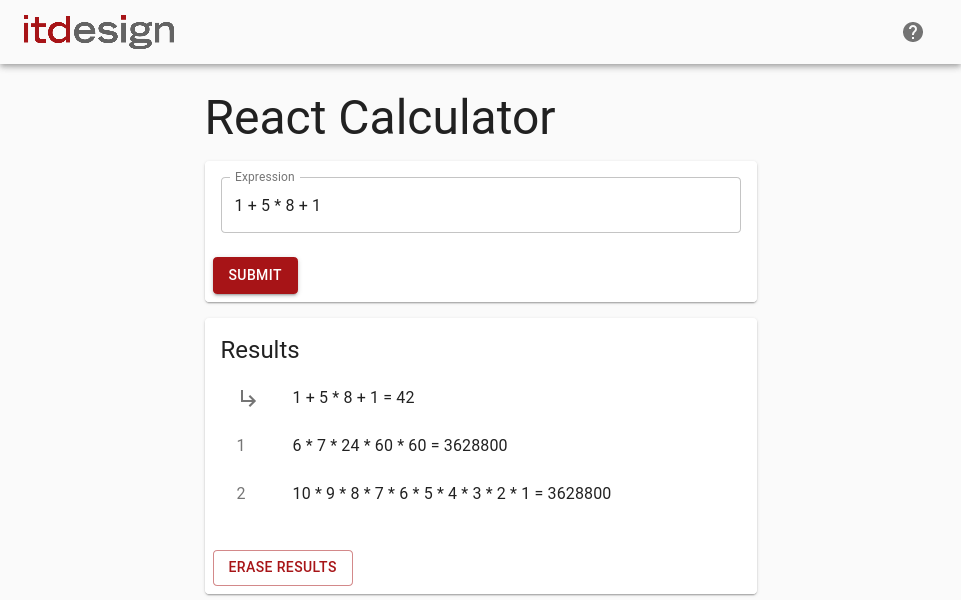
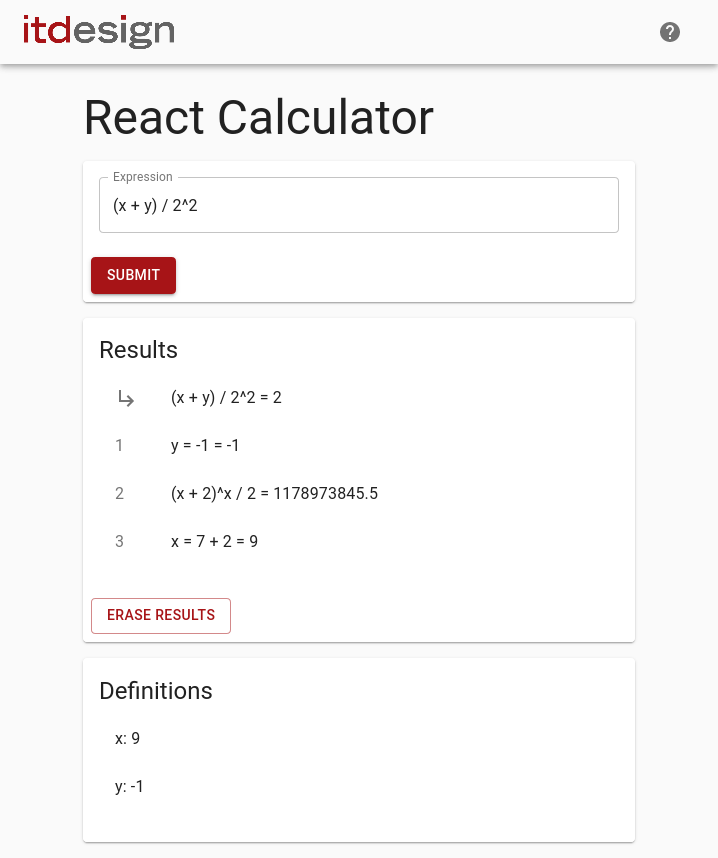

# Inline Calculator

## Introduction

This application uses the JavaScript framework React. It contains a skeleton of a front-end calculator app for inline calculation. Your job is to complete implementation of the React Components and a few functions responsible for the calculator's logic. Furthermore you have to implement a second component to store and display a history of the executed calculations.

## Task Details
You will find three React components in `src/components/`. They render the application's visuals and control its behaviour. The `Layout` component sets up the basic layout and does not need to be extended.

The `ExpressionInput` component is responsible for receiving and handling user interactions.
The `Calculation` class under `src/logic` computes the results from user input after the user pressed *Submit*.
Finally, the `Results` component should display the result of calculations and show a history of past results.
The `App` component is the root component and orchestrates the interaction between the above components and classes.

### Implement the Calculation class
The `Calculation.calculate()` method should evaluate and calculate entered input and return the result. If the given expression is wrong or malformed return `undefined`. Please implement at least the following arithmetic operations: `+, -, *, /`. These are covered by unit tests in `calculation.test.js`. Feel free to extend this set of operations on your own.

### Expression Input and Results
The `ExpressionInput` component should trigger a calculation based on the value of its `TextField`. The result of the computation should be displayed in the `Results` component. Hint: consult the [`TextField` documentation ](https://material-ui.com/components/text-fields/#uncontrolled-vs-controlled) to learn how to react to text input in React components.

If the given expression is wrong or malformed return the 'Wrong input!' statement.
If the expression is correct, it should be displayed with its arguments and result separated by a space character. For example, the input *1.28+2.89*  should be rendered as *1.28 + 2.89 = 4.17*

### Show a History of Computations
Extend the application by adding a History component that displays the already calculated equations.  Hint: you can use the Material-UI [`List`-Component](https://material-ui.com/components/lists/#lists)

The results should be ordered with the newset entry as first element. Additionally it should be possible to clear the entire history using a clear button.

The following mock represents the expected result: 

### Hints

- Form follows function
- Document and test functionality you added.
- You shouldn't modify code outside the mentioned classes, just complete the specified *TODO* statements to make the tests run as expected. Do not use `eval()`.
- You will find some unit tests within the 'test' folder. They may be helpful to implement the solution. To execute all the tests, use following commands: `npm install && npm test`
- You don't need to use the Material UI components. Feel free to just use plain unstyled HMTL to complete the exercise.
- In case you want to continue using Material UI components, [consult their rich documentation](https://material-ui.com/getting-started/example-projects/).

## Extra Features

Do you feel adventurous? In the Flow and want to see where it takes you? Here are some ideas to extend the calculator that might inspire you:

- Add the ability to group expressions by parentheses
- Add more operators (exponents, unary minus, trigonometric functions, etc…)
- Add the ability to define and use variables in your expressions
- Feel free to use TypeScript - although it is not required
- …

